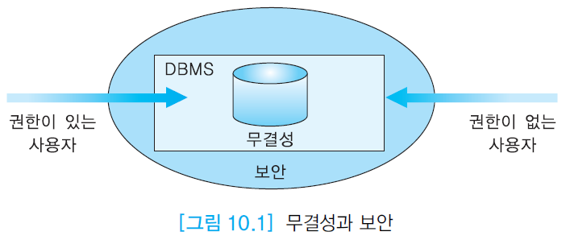

# Ch.10 데이터베이스 보안과 권한 관리

### 데이터베이스 보안과 권한 관리

- 기본적으로 데이터베이스에서 릴레이션을 생성한 사람만 그 릴레이션에 접근할 수 있다.
- 그 이외의 사용자는 생성자가 권한을 부여해 주어야만 접근할 수 있다.
- 그래서 DBMS는 릴레이션의 생성자가 다른 사용자들에게 적절한 수준의 권한을 허가하고, 허가한 권한을 취소하는 권한 관리 기법을 제공함

## 10.1 데이터베이스 보안

### 세 가지 유형의 보안

- 물리적 보호
    - 자연재해, 도둑, 컴퓨터의 물리적 손상 같은 유형의 위험으로 부터의 보호(보안)

- 권한 보호
    - 권한을 가진 사용자만 데이터베이스에 접근할 수 있도록 보호(보안)

- 운영 보호
    - 데이터베이스를 운영함에 있어서 데이터베이스의 무결성에 대한 사용자 실수의 영향을 최소화하는 것



### DBMS가 데이터베이스 보안과 관련하여 제공해야 하는 두 가지 기능

- 접근 제어 (access control)
    - 데이터베이스 시스템에 대한 접근 통제 기능
    - DBMS는 로그인 과정을 제어하기 위해 사용자 계정과 암호를 관리한다.

- 보안 및 권한 관리
    - 사용자들, 사용자들의 그룹이 지정된 데이터베이스 영역만 접근할 수 있고 그 외에는 접근 못 하도록 통제하는 기능 제공

### 두 가지 보안 기법

- 임의 보안 기법 (discretionary security mechanism)
    - 사용자들에게 특정 릴레이션, 투플, 또는 애트리뷰트를 지정된 모드로 접근할 수 있는 권한을 허가하거나 취소하는 기법
    - 사용자, 객체, 권한 세 가지 요소가 관여되어 있다.
    - 어떤 특정 사용자가 어떤 특정 객체에 대해 어떠한 권한으로 접근할 수 있느냐를 통제할 수 있도록 해줌.
    - 대부분의 상용 DBMS에서 사용되는 기법
    - DBMS는 누가 어떤 객체에 대해서 무슨 권한을 가지고 있는지 카탈로그에서 관리해주고 있다.

- 강제 보안 기법 (mandatory security mechanism)
    - 데이터와 사용자들을 다양한 보안 등급으로 분류한다. 그리고 해당 조직에 적합한 보안 정책을 적용하여 다단계 보안을 시행하기 위해 사용됨.
    - 아직 대부분의 DBMS에서 제공하지 않는 기능이다.

### 데이터베이스 보안을 위해 관리자가 수행하는 작업

- 사용자, 사용자 그룹에 대한 새로운 계정, 암호생성, 권한 부여 및 취소 등
- 로그인 세션동안 사용자가 데이터베이스에 가한 모든 연산들을 기록할 수 있다.
- 필요한 것들만 기록을 남김
- 나중에 사건이 발생했을 때 로그를 감사를 할 수 있다.

## 10.2 권한 관리

### 권한 허가


- 권한을 허가하기 위한 SQL문 → GRANT
- 애트리뷰트들 중 부분적으로 권한을 줄 수 있다.
- 그러나 SELECT에 관해서는 부분적으로 권한을 줄 수는 없다.
- 권한들의 집합으로 역할에게 권한을 줄 수 있다.
- GRANT OPTION을 주면 그 사용자도 다른 사용자에게 권한을 부여할 수 있으므로 신중하게 설정해야 함.
- 외래키에 대한 권한을 주기 위해서는 REFERENCES권한을 주면 된다.


### 권한 취소


- 허가한 권한을 취소하기 위해 REVOKE문을 사용한다.
- 만일 어떤 사용자가 다른 사용자에게 허가했던 권한을 취소하면, 권한을 취소당한 사용자가 WITH GRANT OPTION을 통해서 다른 사용자에게 허가했던 권한들도 연쇄적으로 취소됨
- 취소하려는 권한을 허가했던 사람만 그 권한을 취소할 수 있음
- 권한을 허가했던 사람은 자신이 권한을 허가했던 사용자로부터만 권한을 취소할 수 있음

### 역할 (role)


- 비슷하거나 같은 업무를 담당하는 사람들은 데이터베이스의 같은 객체에 대해 같은 권한들을 필요로 함.
- 역할은 권한들의 집합이라고 생각하면 된다.
- 같은 종류의 권한집합을 가지고 있으면 역할을 사용한다.
- 역할은 SQL 표준에는 없다.
- 그래서 DBMS마다 SQL문이 차이가 있고 오라클에서는 CREATE ROLE을 사용한다.
- 어떤 역할과 연관된 권한들에 변화가 생기면 그 역할을 허가받은 모든 사용자들은 자동적으로 즉시 변경된 권한들을 가지게 된다.
- 역할도 GRANT 할 수 있다.
```SQL
GRANT CREATE TABLE TO programmer;
GRANT programmer TO CHOI;
```

## 10.3 오라클의 보안 및 권한 관리

### 오라클의 보안 및 권한 관리

- 권한은 시스템 권한과 객체 권한이 있다.
- 시스템 권한은 사용자가 데이터베이스에서 특정 작업을 수행할 수 있도록 함(객체를 생성 삭제하는 것과 관련된 것)
- 객체 권한은 사용자가 특정 객체에 대해 특정 연산을 수행할 수 있도록 함(SELECT INSERT같은 것)


### 시스템 권한의 허가

- 여기서도 GRANT문을 사용하여 사용자에게 특정 시스템 권한을 허가한다.
```SQL
GRANT CREATE SESSION TO KIM WITH ADMIN OPTION;
```
- 여기서는 ADMIN OPTION으로 GRANT OPTION처럼 권한을 줄 수 있다.
- GRANT OPTION과 다르게 시스템 권한을 취소할 때에는 연쇄적인 취소가 일어나지 않는다.

### 객체 권한

- 객체의 소유자는 객체에 대한 모든 권한을 보유
- 자기가 가지고 있는 권한을 다른 사용자나 역할에게 허가할 수 있다.
- 각 객체마다 허가할 수 있는 권한들에 차이가 있다.


### 미리 정의된 역할

- 대부분의 데이터베이스 시스템에서 이러한 역할들은 항상 있더라라고 생각해서 미리 만들어 놓은 역할들
- 약 20개의 역할이 있다.
- connect 역할: 데이터베이스에 로그인하고, 다른 사용자의 데이터를 검색할 수 있도록 허가 받았으면 이를 검색할 수 있게 하고, 갱신할 수 있도록 했으면 이를 갱신할 수 있는 역할
- resource 역할: 테이블, 인덱스를 생성할 수 있는 역할


### 데이터베이스 관리자 권한

- 데이터베이스 관리자만 관리자 권한을 가진 채 데이터베이스에 접속할 수 있어야 한다.
- 여기에서 SYSOPER는 시스템을 켜고 끄는 권한을 가진 역할이다
