# Ch.6 물리적 데이터베이스 설계

### 물리적 데이터베이스 설계

- 논리적 설계의 데이터베이스 구조를 물리적인 데이터 모델(보조 기억 장치 상의 file)로 사상하는 것
- 고려해야할 사항은 무엇인가
- 설계를 위한 input이 뭐냐, database operation이 무엇인가

## 6.1 보조 기억 장치

### 보조 기억 장치

- 전원이 꺼져도 데이터가 남아있는 비 휘발성 기억 장치들
- Block 단위로 읽고 씀
- 주 기억 장치에서는 WORD 단위로 I/O를 실행
- Block은 512바이트의 배수로 구성된다.
- 많이 쓰는 단위는 4kBytes(4096 바이트)

주 기억 장치는 액세스 속도가 ns 단위이지만 바이트 당 가격이 비싸기 때문에 ms단위로 액세스하는 값싼 보조 기억 장치를 이용한다.

### 자기 디스크 (HDD)

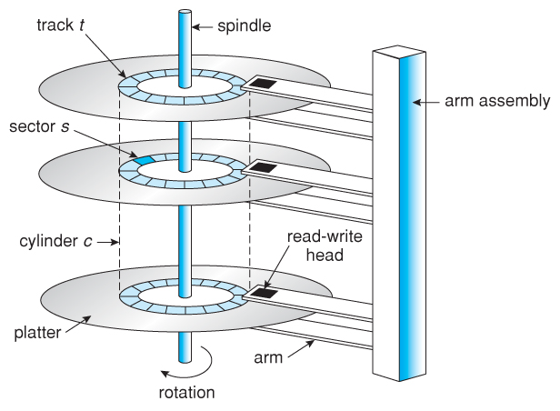

- 여러 개의 판으로 이루어짐.
- 정보는 디스크 내의 트랙을 따라 각 섹터에 저장됨.
- **seek time**: arm의 이동시간
- 같은 실린더 내의 섹터들은 헤드가 움직이지 않아도 읽을 수 있다.
- arm이 움직여서 다른 실린더로 옮겨간다.
- arm이 움직이는 것이 하드디스크 내의 움직임 중에서 가장 느리기 때문에 데이터들을 동일 실린더 내에 존재시킨다.

## 6.2 버퍼 관리와 운영 체제

### 버퍼 관리와 운영 체제

- 디스크 I/O가 컴퓨터 시스템에서 가장 느린 작업이므로 가능한 많은 block들을 주 기억 장치에 유지하거나, 자주 참조되는 block들을 주 기억 장치에 유지하면 DBMS의 성능을 향상하는데 도움을 준다.
- Buffer: 디스크 블록들을 저장하는데 사용되는 주 기억 장치 공간
- LRU 알고리즘을 버퍼 교체 정책으로 사용하지만 모든 데이터베이스에 관해 우수한 성능을 보이지는 않는다.
- LRU 이외의 다른 알고리즘과 함께 데이터베이스 마다 다르게 사용함.

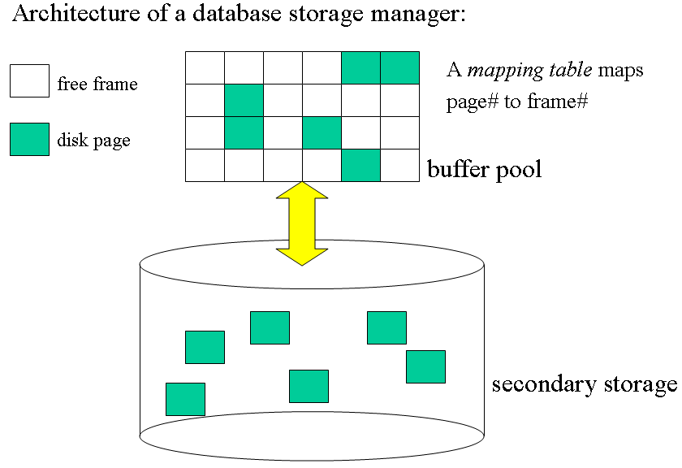

위 그림에서 블럭 하나에 매핑되는 것이 프레임이다.

## 디스크 상에서 file의 레코드 배치

### 디스크 상에서 file의 레코드 배치

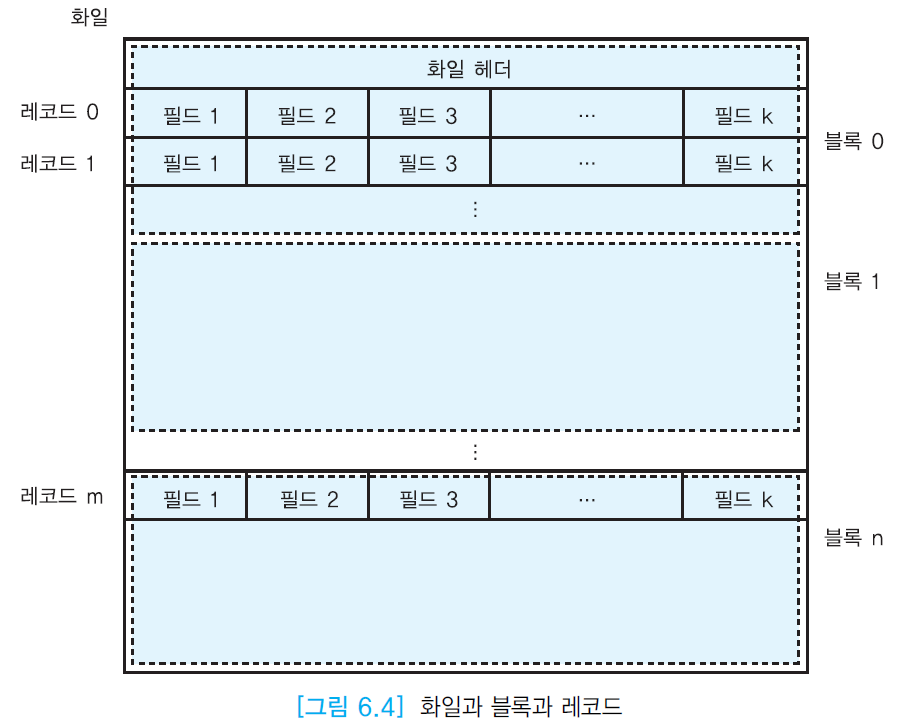

- 릴레이션의 애트리뷰트는 고정 길이 또는 가변 길이의 필드로 표현됨
- 연관된 필드들이 모여서 고정 길이 또는 가변 길이의 레코드가 됨
- 한 릴레이션을 구성하는 레코드들의 모임이 file이라고 부르는 블록들의 모임에 저장됨.

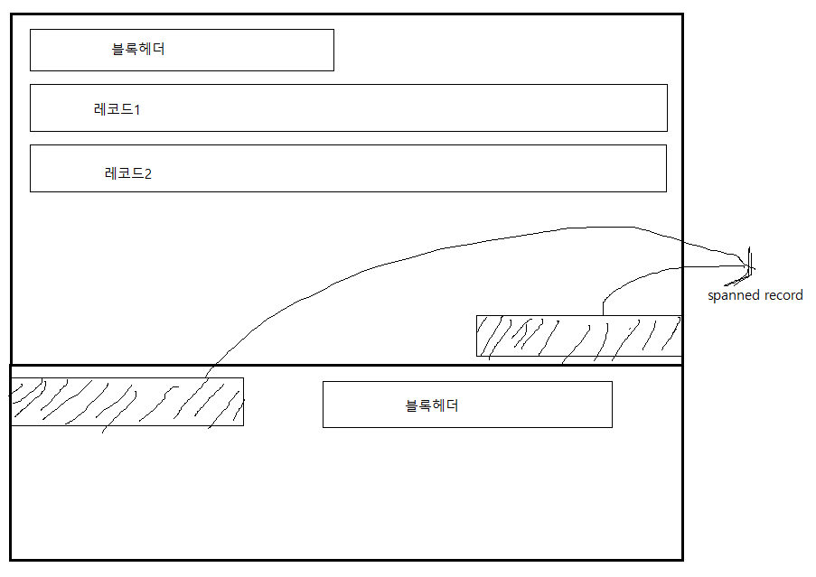

위와 같이 하나의 레코드가 여러 개의 블록에 걸쳐서 저장되어 있을 수도 있다.

- 한 file에 속하는 블록들이 반드시 인접해 있을 필요는 없다.
- 실제로 물리적으로 연속해서 할당하기 힘들다.

### BLOB(Binary Large Object)

- 이미지, 동영상 등 대규모 크기의 데이터를 저장하는데 사용된다.
- 테이블에는 BLOB에 대한 포인터만 들고 있다.

### 채우기 인수

- 각 블록에 레코드를 채우는 공간의 비율
- 나중에 레코드가 더 삽입될 때를 대비하여 기존의 레코드들을 이동하는 가능성을 줄이기 위해 사용

### 고정 길이 레코드

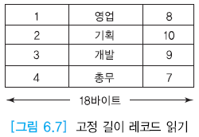

레코드가 고정길이로 정해져 있다.

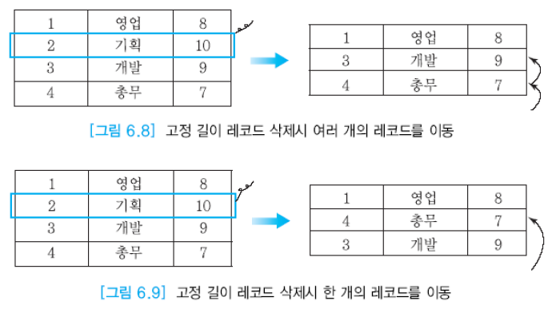

그림 6.9는 순서가 필요없을 때 사용.

### file 내의 클러스터링

한 file 내에서 함께 검색될 가능성이 높은 레코드들을 디스크 상에서 물리적으로 가까운 곳에 모아두는 것

### 릴레이션 간의 클러스터링 -  file 간의 클러스터링

- 논리적으로 연관되어 함께 검색될 가능성이 높은 두 개 이상의 file에 속한 레코드들을 디스크 상에서 물리적으로 가까운 곳에 저장하는 것
- 디스크 arm하고 관련됨

## 6.4 File 조직

### file 조직의 유형

- heap file
- sequential file
- indexed sequential file
- hash file

### heap file - 비순서 file

- 가장 단순한 file 조직
- 레코드들이 삽입된 순서대로 file에 저장된다.
- 삽입: file 가장 끝에 추가된다.
- 검색: 모든 레코드들을 순차적으로 접근해야 한다.
- 삭제: 원하는 레코드를 검색하고 삭제한 후 해당 공간을 재사용하지 않음.
- 성능 유지를 위해 heap file을 주기적으로 재조직 필요

> #### 성능
- 질의에서 모든 레코드를 참조하고, 레코드 접근 순서가 중요하지 않을 때 사용.
- 특정 레코드 검색 시, 비효율적.
- 몇 개의 레코드들을 검색하는 경우, 특정 범위 내의 레코드를 검색하는 경우 또한 비효율적

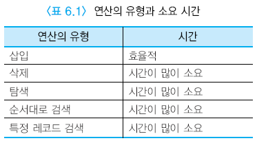

### sequential file - 순차 file

- 하나 이상의 필드 값에 따라 순차적으로 저장된 file
- 일반적으로 _탐색키(search key)_ 에 따라 저장됨
- 탐색키는 순차 file을 정렬하는데 사용되는 필드
- 삽입: 레코드 순서를 고려해야 되므로 시간이 많이 걸릴 수 있다.
- 삭제: heap과 같은 방식
- 기본 인덱스가 순차 file에 정의되지 않는 한 DB응용에 사용되지 않는다.

> #### 성능
> - 탐색키로 검색을 할 때에는 이진 탐색을 이용할 수 있어 빠르다.
> - 그 외의 애트리뷰트로 검색할 때는 heap file과 성능 차이가 없다.


## 6.5 단일 단계 인덱스

### 단일 단계 인덱스 - indexed sequential file

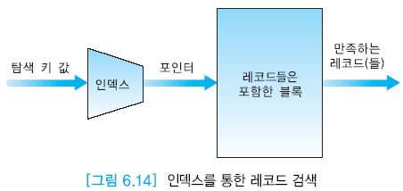

- 인덱스된 순차 file은 인덱스를 통해서 임의의 레코드를 접근할 수 있는 file
- 인덱스: 탐색 키를 가진 레코드의 빠른 검색을 위해 <탐색키, 레코드 포인터>의 쌍을 관리하는 구조
- 인덱스 엔트리: **<탐색키, 레코드 포인터>**
- 엔트리들은 탐색키 값의 오름차순으로 정렬됨
- 인덱스는 데이터 file과 별도의 file로 저장된다.
- 인덱스는 키와 포인터만 있기 때문에 인덱스 file은 데이터 file의 크기보다 훨씬 작다
- 하나의 file에 여러 개의 인덱스를 정의할 수 있다.

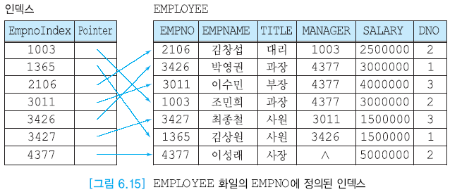
> - 블록의 주소도 같이 들어있다.
> - 인덱스 찾는 시간(log n) + 레코드 액세스 하는 시간
> - 조금 더 빨리 찾을 수 있는 액세스 경로를 DBMS가 선택해준다.

- 인덱스가 정의된 필드를 탐색키라고 부름
- 탐색키의 값들은 반드시 고유하지는 않다 → 키가 아닌 어떤 애트리뷰트도 탐색키로 사용될 수 있다.
- 엔트리가 오름차순으로 정렬되어 있으므로 이진 탐색이 가능하다.

### 기본 인덱스 (primary index)

- 탐색키가 데이터 file의 기본 키인 인덱스를 기본 인덱스라고 한다.
- 기본 인덱스는 흔히 희소 인덱스(sparce index)로 유지할 수 있다.
- 각 릴레이션마다 최대한 한 개의 기본 인덱스를 가질 수 있다.

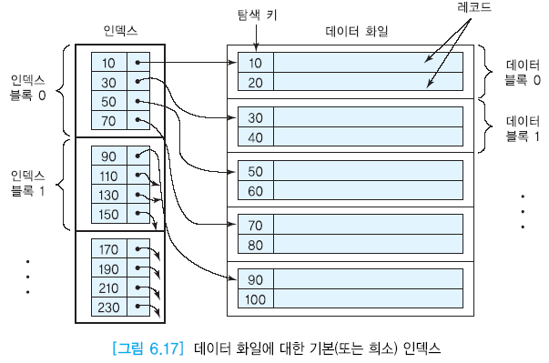
> - 인덱스에 모든 키가 있지 않고 블록 별로 가장 작은 값만 저장되어 있다.
> - 기본 인덱스의 포인터는 블록 포인터
> - 테이블이 정렬되어 있기 때문에 희소 인덱스를 쓸 수 있다.
> - 블록 크기가 작아졌기 때문에 순차 file보다 이진 탐색 속도가 감소된다.

### 클러스터링 인덱스 (clustering index)

- 탐색 키 값에 따라 정렬된 데이터 file에 대해 정의된다.
- 기본 키 값이 비슷한 레코드끼리 묶어서 인덱스를 구성하는 것.
- 각각의 상이한 키 값마다 하나의 인덱스 엔트리가 인덱스에 포함된다.
- 논리적으로 연관된 레코드들을 물리적인 디스크 상에 인접하게 기억시켜 접근 효율을 향상시키는 인덱스
- 범위 질의에 유용.
- 범위의 시작 값에 해당하는 인덱스 엔트리를 먼저 찾고 범위에 속하는 인덱스 엔트리를 따라가면서 레코드들을 검색.

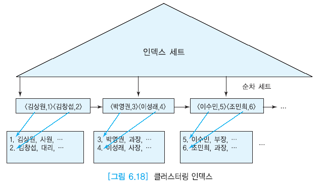
> 여기서 인덱스 세트는 클러스터링 인덱스의 세트

### 보조 인덱스 (secondary index)

- 한 file은 기껏해야 한 가지 필드들의 조함에 대해서만 정렬될 수 있다.
- 보조 인덱스는 unique한 키 값이 아니어도 된다.
- 보조 인덱스는 탐색키 값에 따라 정렬되지 않은 데이터 file에 대해 정의됨.
- 보조 인덱스는 일반적으로 밀집 인덱스(dense index)이므로 같은 수의 레코드들을 접근할 때 보조 인덱스를 통하면 기본 인덱스를 통하는 경우보다 디스크 I/O가 증가할 수 있다.

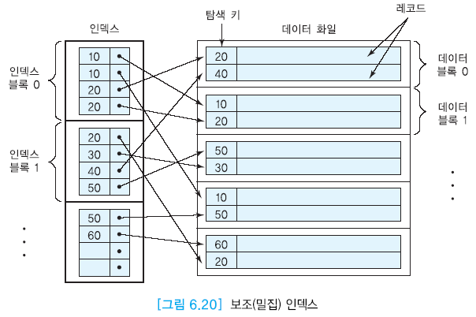
> - 중복이 있으므로 비효율적이고 일관성이 없다.
> - 정렬되지 않은 데이터에 대한 인덱스 값을 이용하였다.
> - 밀집 인덱스의 포인터는 레코드 포인터

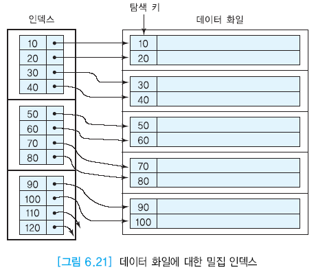
> 밀집 인덱스이므로 포인터 타입이 레코드 포인터이다.

### 희소 인덱스와 밀집 인덱스의 비교

- 희소 인덱스는 각 데이터 블록마다 한 개의 엔트리를 갖고, 밀집 인덱스는 각 레코드마다 한 개의 엔트리를 가진다. → 포인터 타입이 다르다.
> - 희소: block pointer
> - 밀집: record pointer

- 레코드의 길이가 블록 크기보다 훨씬 작은 일반적인 경우에는 희소 인덱스의 엔트리 수가 밀집 인덱스의 엔트리 수보다 훨씬 적음
- 희소 인덱스는 일반적으로 밀집 인덱스에 비해 인덱스 단계 수가 1정도 적으므로 디스크 I/O가 1만큼 적을 수 있다.
- 그래서 희소 인덱스는 밀집 인덱스에 비해 모든 갱신과 대부분의 질의에 대해 더 효율적이다.
- 그러나 인덱스가 정의된 애트리뷰트만 검색하는 경우에는 데이터 file에 접근할 필요 없이 인덱스만 접급해서 질의를 수행할 수 있으므로 밀집 인덱스가 희소 인덱스보다 유리하다.

### 클러스터링 인덱스와 보조 인덱스의 비교

- 클러스터링 인덱스는 기본 인덱스와 함께 이용되고 희소 인덱스일 경우가 많으며 범위 질의에 좋다.
- 보조 인덱스는 밀집 인덱스이므로 일부 질의에 대해서는 file 접근 없이 처리 가능하다.

## 6.6 다단계 인덱스

### 다단계 인덱스

- 인덱스 엔트리를 탐색하는 시간을 줄이기 위해 단일 단계 인덱스에 대해서 다시 인덱스를 정의하여 사용하는 방법.
- 다단계 인덱스는 가장 상위 단계의 모든 인덱스 엔트리들이 한 블록에 들어갈 수 있을 때까지 이 과정을 반복한다.
- **마스터 인덱스(master index)**: 다단계 인덱스에서 가장 상위 단계 인덱스
- 마스터 인덱스는 한 블록이기 때문에 주 기억 장치에 상주할 수 있다.
- 모든 인덱스는 마스터 인덱스를 거치기 때문에 메인 메모리에 캐시해 둠으로써 속도를 빠르게 한다.
- 대부분의 다단계 인덱스는 _B$^+$-트리_ 를 사용한다.

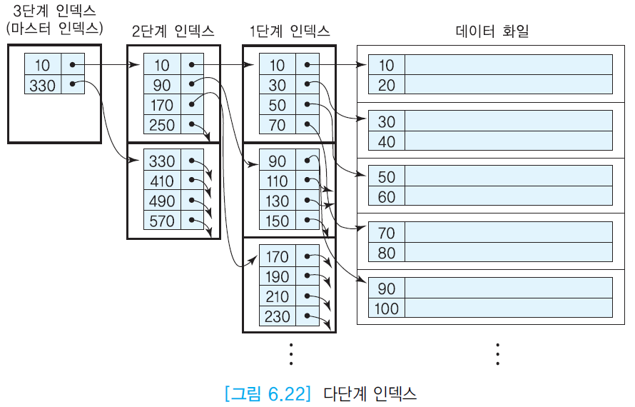

### SQL의 인덱스 정의문

- 인덱스가 없으면 제약조건을 확인해야 되서 작업이 오래 걸린다.
- 그래서 테이블을 생성할 때 기본키로 설정한 애트리뷰트에 관해서 DBMS가 자동으로 기본 인덱스를 생성한다.
- UNIQUE로 명시한 애트리뷰트에 대해서는 DBMS가 자동으로 보조 인덱스를 생성
- 추가로 인덱스를 생성할 때에는 CREATE INDEX문을 사용한다.(DBMS마다 구문이 조금씩 다르다)

### 다수의 애트리뷰트를 사용한 인덱스 정의

- 한 릴레이션에 속하는 두 개 이상의 애트리뷰트들의 조합에 대해 하나의 인덱스를 정의할 수 있다.
```SQL
CREATE INDEX EMPINDEX ON EMPLOYEES (DNO, SALARY);
```
- 이 인덱스는 아래의 질의에 활용될 수 있다.
```SQL
-- point query
SELECT * FROM EMPLOYEES WHERE DNO=3 AND SALARY=4000000;
-- range query
SELECT * FROM EMPLOYEES WHERE DNO>=3 AND DNO<=3 AND SALARY>=3000000 AND SALARY<=4000000;
```
- 아래의 질의에도 활용될 수 있다.
```SQL
-- point query
SELECT * FROM EMPLOYEES WHERE DNO=3;
```
- 그러나 아래의 질의에는 활용될 수 **_없다_**.
```SQL
SELECT * FROM EMPLOYEES WHERE SALARY>=3000000 AND SALARY<=4000000;
-- 또는 SALARY에 대한 동등조건
```
- 왜냐하면 다수의 애트리뷰트를 사용한 인덱스의 경우 symmetric한 게 아니라 순서를 가지기 때문.
- 이 경우 DNO가 결정되어야 SALARY가 결정되므로 SALARY 단독으로 WHERE절에 사용할 수 없다.

### 인덱스의 장단점

- 인덱스는 검색 속도를 향상시키지만 저장 공간이 추가로 필요하다.
- 그리고 삽입, 삭제, 수정 연산의 속도는 저하시킨다.
- 그러나 소수의 레코드 들을 수정, 삭제하는 연산의 속도는 향상됨.
- 릴레이션이 매우 크고 투플 중에 매우 일부만을 검색하는 경우에서 성능 향상이 있다.
- 인덱스가 논리적으로 일관되게 만들어야 한다.
- 인덱스 개수가 작은 것들을 인덱스로 만든다.

## 인덱스 선정 지침과 데이터베이스 튜닝

### 인덱스 선정 지침과 데이터베이스 튜닝

- workload에 기반해서 인덱스를 선정한다.
- 각 릴레이션에서 인덱스를 생성해야 하는지부터 고민하고 해야한다고 생각되면 어떤 애트리뷰트를 탐색키로 선정할지, 그리고 몇 개의 인덱스를 생성해야 하는가, 각 인덱스에 대해 어떤 유형의 인덱스를 선택할 것인가 등을 고려한다.

### 인덱스를 결정하는데 도움이 되는 몇 가지 지침

1. 기본키는 클러스터링 인덱스를 정의할 훌륭한 후보
2. 외래키도 인덱스를 정의할 중요한 후보 (그래도 기본키를 주로 사용하자.)
3. 투플이 많이 들어있는 릴레이션에서 대부분의 질의가 검색하는 투플만 찾는 경우에 인덱스를 생성하자.
4. 자주 갱신되는 애트리뷰트에는 인덱스 생성하지 말자.
5. 자주 갱신되는 릴레이션에는 인덱스를 많이 만들지 말자.
6. 인덱스는 file의 레코드들을 **충분히** 분할할 수 있어야 한다.
7. 정수형 애트리뷰트에 인덱스를 생성하도록 하자.
8. 작은 file에는 인덱스 만들지 말기.
9. 대량의 데이터를 삽입할 때에는 모든 인덱스를 제거하고 삽입이 끝난 후에 다시 생성하도록 하자.

### 언제 인덱스가 사용되지 않는가?

- 릴레이션의 크기가 작아서 인덱스가 도움이 되지 않을 때
- 인덱스가 정의된 애트리뷰트에 산술연산자가 사용될 때
```SQL
SELECT * FROM EMPLOYEES WHERE SALARY*12 > 40000000;
```
- 널값에 대해서는 일반적으로 인덱스가 사용될 때(널값을 조건으로 갖는 애트리뷰트)
```SQL
SELECT * FROM EMPLOYEES WHERE MANAGER IS NULL;
```

### 질의 튜닝을 위한 추가 지침

- DISCTINCT, GROUP BY, HAVING 절의 사용을 최소화 한다. → 처리하는데 비용이 비싼 operation을 피하라는 것.
- 임시 릴레이션의 사용을 피하라(조인 질의 같은 것들). → 추가 공간을 더 쓰고 액세스 시간을 더 사용함.
- SELECT \* 대신에 구체적인 애트리뷰트 이름 명시하기 → 네트워크 트래픽 최소화를 위함.
