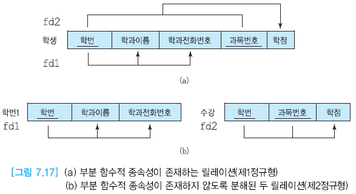

# Ch.7 릴레이션 정규화

### 릴레이션 정규화

- 부주의한 데이터베이스 설계는 여러 가지 **갱신 이상(update anormaly)** 를 유발한다.
- 그래서 **정규화(normalization)** 을 사용한다.
- **정규화**: 주어진 릴레이션 스키마를 함수적 종속성과 기본키를 기반으로 분석하여, 원래의 릴레이션을 분해함으로써 중복과 세 가지 갱신 이간을 최소화함.

## 7.1 정규화 개요

### 좋은 관계 데이터베이스 스키마를 설계하는 목적

- 정보의 중복과 갱신 이상이 생기지 않도록 한다.
- 정보의 손실을 막는다.
- 실세계를 왜곡해서는 안된다.
- 애트리뷰트들 간의 관계가 잘 표현되는 것을 보장.
- 무결성 제약조건의 시행을 간단하게 한다.
- 먼저 갱신 이상이 발생하지 않도록 노력하고, 그 다음에 효율성을 고려함.

### 갱신 이상 (update anormaly)

- 수정 이상 (modification anormaly)
    - 반복된 데이터 중에 일부만 수정하면 데이터의 불일치가 발생
- 삽입 이상 (insertion anormaly)
    - 불필요한 정보를 함께 저장하지 않으면 어떤 정보를 저장하는 것이 불가능
- 삭제 이상 (deletion anormaly)
    - 유용한 정보를 함께 삭제하지 않으면 어떤 정보를 삭제하는 것이 불가능

> - 기획을 김창섭투플에서만 바꾸면 이수민투플의 기획 부서이름은 그대로 → 수정이상
> - 김창섭 투플을 지우면 1번 영업 부서도 사라짐 → 삭제이상
> - 4번 부서를 추가하기 위해서는 존재하지 않는 사원을 추가해야 함 → 삽입이상

### 릴레이션 분해

- 하나의 릴레이션을 두 개 이상의 릴레이션으로 나누는 것
- 분해된 릴레이션들로부터 원래의 릴레이션을 **_다시 구할 수 있음을 보장_** 해야 한다는 원칙을 기반으로 분해해야 한다.
- 잘못 분해하면 분해된 릴레이션으로부터 얻을 수 있는 정보가 원래의 릴레이션이 나타내던 정보와 다를 수 있다.
- 함수적 종속성에 관한 지식을 기반으로 분해해야 한다.

### 정규형(normal form)의 종류

- 제1정규형(1NF), 제2정규형(2NF), 제3정규형(3NF), BCNF(Boyce-Codd Normal Form), 제4정규형(4NF), 제5정규형(5NF)이 있다.
- 일반적으로 데이터베이스 설계에서 BCNF까지만 고려한다.

### 관계 데이터베이스 설계의 비공식적인 지침

- 이해하기 쉽고 명확한 스키마를 만들라.
    - 여러 엔티티 타입이나 관계 차입에 속한 애트리뷰트들을 하나의 릴레이션에 포합시키지 않음.
- 널값을 피하라.
- 가짜 투플이 생기지 않도록 하라.
- 스키마를 정제하라.

## 함수적 종속성

### 함수적 종속성(Functional Dependency)의 개요

- 릴레이션의 애트리뷰트들의 의미로부터 결정됨.
- 릴레이션의 특정 인스턴스에 대한 주장이 아닌 릴레이션 스키마에 대한 주장이다.
- 릴레이션의 가능한 모든 인스턴스들이 만족해야 함.
- 실세계의 지식과 응용의 의미를 기반으로 함.
- 제2정규형부터 BCNF까지 적용된다.

### 결정자 (determinant)

- 주어진 릴레이션에서 다른 애트리뷰트의 값을 고유하게 결정하는 하나 이상의 애트리뷰트
- 결정자는 다음과 같이 표기하고, 이를 A가 B를 결정한다(A는 B의 결정자이다)라고 말함.
    - A → B

### 함수적 종속성

- 애트리뷰트 A가 애트리뷰트 B의 결정자이면 B가 A에 함수적으로 종속한다고 말함.
- 주어진 릴레이션 R에서 애트리뷰트 B가 애트리뷰트 A에 함수적으로 종속하는 필요충분조건은 각 A값에 대해 반드시 한 개의 B값이 대응된다는 것이다.

### 완전 함수적 종속성 (FFD: Full Functional Dependency)

- 주어진 릴레이션 R에서 애트리뷰트 B가 애트리뷰트 A에 함수적으로 종속하면서 애트리뷰트 A의 어떠한 진부분 집합에도 함수적으로 종속하지 않을 때를 말한다.
- 여기서 애트리뷰트 A는 복합 애트리뷰트이다.

### 이행적 함수적 종속성 (Transitive FD)

- (A,B) → C일 때 C는 A와 B에대해 이행적 종속성을 가진다고 한다.
- 애트리뷰트 C가 애트리뷰트 A에 이행적으로 종속한다(A → C)는 것의 필요충분조건은 A → B ∩ B → C가 성립할 때이다.
- A가 릴레이션의 기본키이면 A → B와 A → C가 성립하고, 만일 C가 B에도 함수적으로 종속한다면 C는 A에 직접 함수적으로 종속하면서 B를 거쳐서 A에 이행적으로 종속한다고 한다.

## 7.3 릴레이션 분해

### 릴레이션 분해

- 하나의 릴레이션을 두 개 이상의 릴레이션으로 나누는 것
- 릴레이션을 분해하면 중복이 감소되고 갱신 이상이 줄어드는 장점이 있지만 몇 가지 문제가 발생할 수 있다.
    - 릴레이션이 분해되기 전에 조인이 필요없는 질의가 분해 후에 조인이 필요한 질의로 바뀔 수 있음.
    - 분해된 릴레이션들을 사용하여 원래 릴레이션을 재구성하지 못할 수 있음.

### 무손실 분해 (loseless decomposition)

- 분해된 릴레이션들을 조인하면 원래의 릴레이션에 들어있는 정보를 완전하게 얻을 수 있다.
- 여기서 손실이란 정보의 손실을 말하고 원래의 정보보다 적거나 많은 것을 모두 포함한다.

> 정보 손실이 발생했고 가짜 투플이 생겼으므로 나쁜 분해이다.

## 7.4 제1정규형, 제2정규형, 제3정규형, BCNF

정규화(릴레이션 분해)
- loseless decomposition: 분해된 릴레이션들을 조인하여 원래 릴레이션을 복구. (가짜 투플이 추가되거나 있던 투플이 삭제되지 않도록)
- functional dependency preservation: 함수적 종속성이 실세계에 존재하는 제약조건

### 제1정규형 (1NF)

- 모든 애트리뷰트가 원자값만을 갖는다.
- 그러므로 다치 애트리뷰트가 존재하면 안 된다.
- 즉 모든 애트리뷰트에 반복 그룹이 나타나지 않으면 제1정규형을 만족함.

- 제1정규형에서 갱신 이상이 발생할 수 있음 → 기본키에 대한 부분 함수적 종속성이 존재할 수 있기 때문
- 그래서 제1정규형에서 부분 함수적 종속성을 없앰 → 제2정규형

### 제2정규형 (2NF)

- 어떤 릴레이션이 제1정규형을 만족하면서 부분 함수적 종속성이 존재하지 않고 전부 완전 함수적 종속성일 때 제2정규형을 만족한다고 한다.
- 기본키가 2개 이상의 애트리뷰트로 구성되었을 경우에만 제1정규형이 제2정규형을 만족하는가를 고려할 필요가 있다.

- 제2정규형에서도 갱신 이상이 발생할 수 있음 → 릴레이션에 이행적 종속성이 존재할 수 있기 때문
- 그래서 제2정규형에서 이행적 종속성을 없앰 → 제3정규형

### 제3정규형 (3NF)

- 어떤 릴레이션이 제2정규형을 만족하면서 키가 아닌 모든 애트리뷰트가 릴레이션의 기본키에 이행적으로 종속하지 않을 때
- 즉 제2정규형을 만족하면서 이행적 종속성이 없고 완전 함수적 종속성만 있을 때 제3정규형을 만족한다고 한다.

- 제3정규형에서도 갱신 이상이 발생할 수 있음 → 릴레이션에서 키가 아닌 애트리뷰트가 다른 애트리뷰트를 결정할 수 있기 때문.
- 그래서 키만이 다른 애트리뷰트를 결정하도록 함 → BCNF

### BCNF (Boyce-Codd NF)

- 어떤 제3정규형을 만족하고 모든 결정자가 후보키일 때 BCNF를 만족한다고 한다.
- 제3정규형에서 BCNF로 넘어오면서 함수적 종속성이 보존되지 않을 수 있다.
- 제3정규형을 만족하는 대부분의 릴레이션은 BCNF도 만족한다,
- 하나의 후보키만을 가진 릴레이션이 제3정규형을 만족하면 동시에 BCNF도 만족한다.

### BCNF 만드는 방법

- 제3정규형을 만족하는 릴레이션에서 키가 아니면서 결정자 역할을 하는 애트리뷰트와 그 결정자에 함수적으로 종속하는 애트리뷰트를 하나의 테이블에 넣는다. 이 릴레이션에서 결정자는 기본 키가 된다.
- 그리고 기본 릴레이션에 결정자를 남겨서 기본키의 구성요소가 되도록 한다. 또한 이 결정자는 새로운 릴레이션에 대한 외래키 역할도 한다.

### 여러 정규형의 요약

## 7.5 역정규화 (denormalization)

조인은 비싼 연산(연산 시간 등 비용이 많이 발생하는 연산)이기 때문에 분해가 성능에 많은 영향을 끼친다면 역정규화를 할 필요가 있다.

### 정규화 장단점

- 정규화 단계가 진행될 수록 중복이 감소하고 갱신 이상도 감소되며 무결성 제약조건을 시행하기 위한 코드의 양도 감소된다.
- 하지만 성능상의 관점에서만 본다면 높은 정규형을 만족하는 릴레이션 스키마가 최적은 아니다.
- 정규화가 진행될 때마다 릴레이션 분해가 일어나기 때문에 조인의 필요성이 증가하므로 어떤 질의에 대한 비용이 증가한다.

### 역정규화

- 많은 데이터베이스 응용에서 검색 질의의 비율이 갱신 질의의 비율보다 훨씬 높기 때문에 수행 속도를 높이고 cost를 줄이기 위해 정규화로 인해 분해된 릴레이션을 합치는 작업을 역정규화라고 한다.
- 즉 역정규화는 보다 낮은 정규형으로 되돌아가는 것이다.

