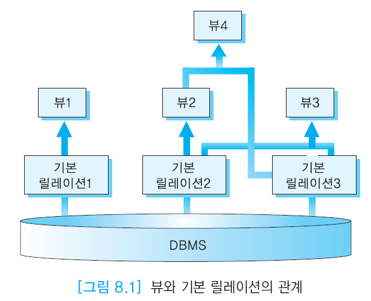
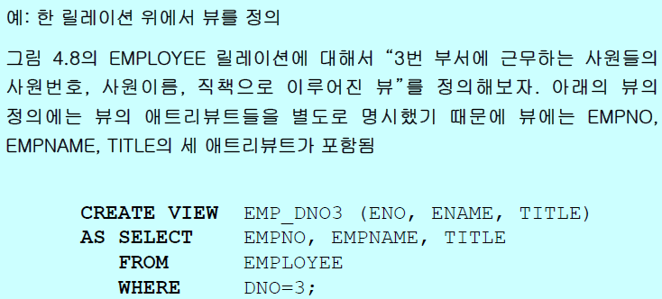
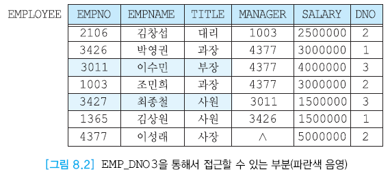
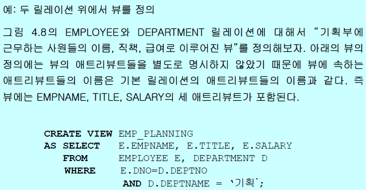
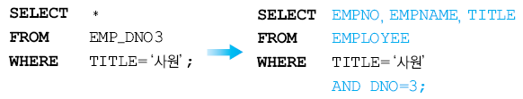
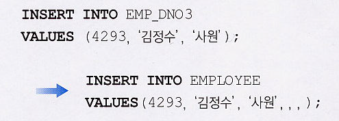
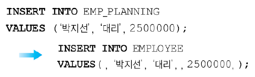
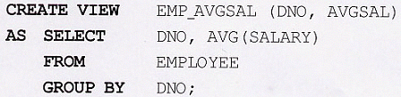
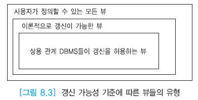
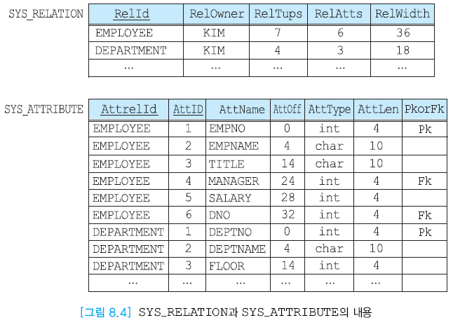

# Ch.8 뷰와 시스템 카탈로그 - 오라클

### 뷰 (view)
- 다른 릴레이션으로부터 유도된 릴레이션(derived relation)
- 관계 데이터베이스 시스템에서 데이터베이스의 보안 메커니즘으로서 복잡한 질의를 간단하게 표현하고, 데이터 독립성(isolation)을 높이기 위해서 사용된다.

### 시스템 카탈로그 (system catalog)
- 시스템 내의 객체(기본 릴레이션, 뷰, 인덱스, 사용자 등)에 관한 정보를 포함.
- 적절히 활용하면 원하는 릴레이션을 데이터베이스에서 찾고, 릴레이션의 정보나 각 애트리뷰트의 데이터타입은 무엇인가 등을 쉽게 파악할 수 있다.

## 8.1 뷰

### 뷰의 개요

- ANSI/SPARC 3단계 아키텍처에서의 뷰인 외부 뷰(external view)(특정 사용자가 보는 데이터베이스의 구조)와는 다르다.
- 한 사용자의 전체 외부 뷰 대신에 하나의 가상 릴레이션(virtual relation)을 의미한다.
- 기본 릴레이션(base relation; 실제 릴레이션)에 대한 SELECT문의 출력으로 나온 것을 봄.
- 그 형태로 정의 된 것이 **_뷰_** 다.
- 사용자는 여러 가지의 뷰를 사용할 수 있고, 뷰는 동적인 창(dynamic window)의 역할을 한다.


> 뷰를 릴레이션처럼 사용할 수 있다.

### 스냅샷 (snapshot)

- 어느 시점에서의 SELECT문의 결과를 기본 릴레이션의 형태로 저장(복제)해 놓은 것
- 스냅샷은 사진 찍은 것처럼 해당 시점의 결과 내용이 저장된다.
- 뷰는 기본 릴레이션이 갱신되면 바뀌지만 스냅샷은 바뀌지 않는다.
    - ▷ view ≠ snapshot

### 뷰의 정의

- 뷰를 정의하는 SQL문의 구문
```SQL
CREATE VIEW viewname ( attr1, attr2, ... )
AS ( SELECT ... )
[WITH CHECK OPTION]
```
- 뷰이름 다음에 애트리뷰트들을 생략하면 뷰를 정의하는데 사용된 SELECT절에 열거된 애트리뷰트들의 이름과 동일하게 된다.
- 두 개 이상의 릴레이션을 조인해서 뷰를 만들었을 때 동일한 애트리뷰트의 이름이 있으면 이름을 모두 다 따로 지정해주어야 함.





### 뷰를 사용하여 데이터를 접근할 때 관계 DBMS에서 거치는 과정

- 시스템 카탈로그로 부터 뷰의 정의를 검색
- 뷰의 접근권한 검사
- 뷰에 대한 질의를 기본 릴레이션에 대한 동등한 질의로 변환



### 뷰의 장점

- 복잡한 질의를 간단하게 함.
- 데이터 무결성 보장
    - 기본적으로 뷰를 통해 투플을 추가하거나 수정할 때 투플이 뷰를 정의하는 SELECT문의 WHERE절의 기준에 맞지 않으면 뷰의 내용에서 사라짐
- 데이터 독립성 제공 (indirection)
- 데이터 보안기능 제공
    - 원하는 뷰에 관해서만 권한을 줄 수 있다.

### 뷰의 갱신

- 뷰에 대한 갱신도 기본 릴레이션에 대한 갱신으로 변환된다.
- 한 릴레이션 위에서 정의된 뷰에 대한 갱신


> 빈 칸은 다 널값으로 들어감.

- 두 개의 릴레이션 위에서 정의된 뷰에 대한 갱신, 집단 함수, 조인 등을 포함한 뷰에 대한 갱신




### 갱신이 불가능한 뷰

- 위의 경우에서 한 릴레이션 위에서 정의되고 그 릴레이션의 기본 키가 포함된 뷰의 경우에는 갱신이 된다.
- 하지만 기본 키가 포함되지 않으면 갱신이 불가능하다.
- 그리고 뷰에 없는 애트리뷰트에 NOT NULL이 지정되어 있을 때도 갱신이 불가능하다.
- 또한 위의 두 개의 릴레이션 위에서 정의된 뷰와 집단함수, 조인 등이 포함된 뷰는 갱신이 불가능하다.
- 갱신을 해버리면 데이터 불일치가 일어나기 때문이다.
- 두 개 이상의 릴레이션에 대해서 이론적으로는 가능하지만 오버헤드가 너무 크기 때문에 상용 DBMS가 허용하지 않는다.



## 8.2 관계 DBMS의 시스템 카탈로그

### 시스템 카탈로그

- 시스템 카탈로그는 데이터베이스의 객체와 구조들에 관한 모든 데이터를 포함한다.
- 다른 말로 메타데이터라고도 한다. (메타데이터는 데이터에 관한 데이터라는 의미)
- 데이터 사전(data dictionary) 또는 시스템 테이블이라고도 부름.

### 시스템 카탈로그가 질의 처리에 어떻게 활용되는가

- SELECT문이 문법적으로 정확한가를 검사한다.
- 질의 처리가 어떻게 되는지 알 수 있다.
- 릴레이션이 데이터베이스에 존재하는지 확인할 때 시스템 카탈로그에서 볼 수 있다.
- 시스템 카탈로그는 타입정보도 들고 있다.
- 권한에 대한 정보도 들고 있다.
- 릴레이션의 인덱스에 대한 정보도 확힝할 수 있다.

### 질의 최적화

- 통계 데이터(통계 정보)가 정확하게 유지되는 것이 중요하다.


> - SYS_ATTRIBUTE에서 AttOff는 애트리뷰트 오프셋이고 이것은 고정길이 애트리뷰트에 대한 오프셋이며 가변길이 애트리뷰트에 대한 오프셋을 정해져 있지 않다.
> - 저장될 때 고정길이 애트리뷰트가 앞에 몰아서 저장되고 가변길이 애트리뷰트가 뒤에 저장된다.

### 시스템 카탈로그의 갱신

- 어떤 사용자도 시스템 카탈로그를 직접 갱신할 수 없다.

### 시스템 카탈로그에 유지되는 통계 정보

- 릴레이션 마다 투플의 크기, 투플 수, 릴레이션의 크기(블록 수) 등이 저장된다.
- 뷰마다 뷰의 이름과 정의가 저장된다.
- 애트리뷰트마다 unique한 값들의 개수, 데이터 타입, 크기 등이 저장된다.
- 사용자마다 접근권한이 저장된다.
- 인덱스마다 인덱스된 애트리뷰트, 인덱스 유형 등이 저장된다.

시스템 카탈로그는 시스템 테이블스페이스에 저장된다. 이때 테이블스페이스는 물리적인 저장공간이고 시스템 테이블스페이스와 유저 테이블스페이스로 나뉜다.
