# Ch.9 트랜잭션

### 트랜잭션

- 동시성 제어 (concurrency control)
    - 동시에 수행되는 트랜잭션들이 데이처베이스에 미치는 영향은 이들을 순차적으로 수행하였을 때 데이터베이스에 미치는 영향과 같도록 보장,
    - 다수의 사용자가 데이터베이스를 동시에 접근하도록 허용하면서 데이터베이스의 일관성을 유지해야 함.

- 회복 (recovery)
    - 데이터베이스를 갱신하는 도중에 시스템이 고장나도 데이터베이스의 일관성을 유지해야 함.

## 9.1 트랜잭션 개요

### 트랜잭션의 특성 (ACID 특성)

- Atomicity (원자성)
    - All or Nothing. 한 트랜잭션 내의 모든 연산들이 완전히 수행되거나 전혀 수행되지 않음을 의미
    - 시스템이 다운되는 경우, 부분적으로 데이터베이스를 갱신한 트랜잭션의 영향을 취소함으로써 트랜잭션의 원자성을 보장한다.

- Consistency (일관성)
    - 무결성
    - 일관된 상태가 새로운 일관된 상태가 되는 것
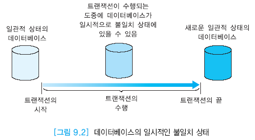

- Isolation (고립성)
    - 한 트랜잭션이 갱신하는 동안 다른 트랜잭션의 접근을 막고 내버려 두는 것
    - 완료되기 전까지 갱신중인 데이터에 다른 트랜잭션들이 접근하지 못하도록 한다.
    - DBMS의 동시성 제어 모듈이 트랜잭션의 고립성을 보장한다.

- Durability (지속성)
    - 영원히 보장됨.
    - 한 트랜잭션이 완료되면 이 트랜잭션이 갱신한 데이터는 그대로 손실되지 않아야 한다.
    - DBMS의 회복 모듈이 완료된 트랜잭션의 효과를 시스템의 고장 또는 다운되는 경우에도 데이터베이스에 반영하여 지속성을 보장한다.
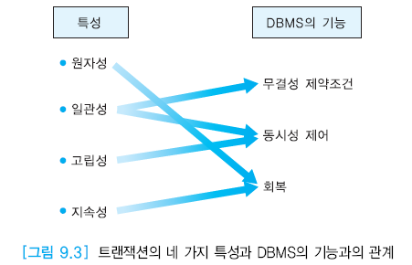

### 트랜잭션의 완료 (commit)

- 트랜잭션에서 변경하려는 내용이 데이터베이스에 완전하게 반영된다.
- SQL문으로 COMMIT ...

### 트랜잭션의 철회 (abort)

- 트랜잭션에서 변경한 내용을 트랜잭션이 수행되기 전 상태로 되돌린다.
- SQL문으로 ROLLBACK ...

### 트랜잭션이 성공하지 못하는 원인

- 시스템 고장
- 트랜잭션 고장
- 매체 고장
- 통신 고장 등..

## 9.2 동시성 제어

- 대부분의 DBMS가 다수 사용자용이고 여러 사용자들이 동시에 동일한 테이블에 접근할 수 있기 때문에 동시성 제어가 필수적이다.
- 동시성 제어 기법은 여러 트랜잭션이 동시에 수행될 때 부정확한 결과를 생성할 수 있는 트랜잭션 간의 간섭을 막는다.

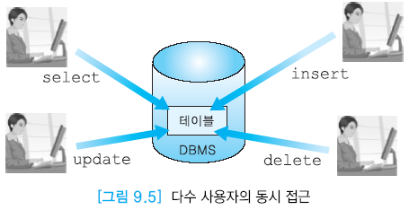

#### 직렬 스케줄 (serial schedule)
- 여러 트랜잭션들의 집합을 한 번에 한 트랜잭션 씩 차례대로 수행한다.
- N개의 트랜잭션이 있을 때 직렬 스케줄이 나올 수 있는 경우의 수는 N!이다.

#### 비직렬 스케줄 (non-serial schedule)
- 여러 트랜잭션들을 동시에 수행한다.

#### 직렬가능 (serializable)
- 비직렬 스케줄의 결과가 어떤 직렬 스테줄의 수행 결과와 동등할 때 직렬가능이라 한다.

### 데이터베이스 연산

- Input(X): X를 포함하고 있는 블록을 메인메모리의 버퍼로 읽어들임
- Output(X): X를 포함하고 있는 블록을 디스크에 기록함
- read_item(X): 메인메모리 버퍼에서 X의 값을 프로그램 변수 X로 복사함
- write_item(X): 프로그램 변수 X의 값을 메인메모리 버퍼의 X에 기록함

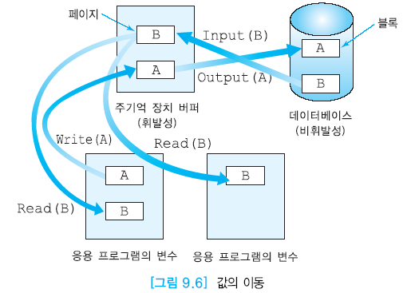

### 동시성 제어를 하지 않았을 때의 문제

- 갱신 손실 (lost update): 수행 중인 트랜잭션이 갱신한 내용을 다른 트랜잭션이 덮어 씀으로써 갱신이 무효가 되는 것
- 오손 데이터 읽기 (dirty read): 완료되지 않은 트랜잭션이 갱신한 데이터를 읽는 것
- 반복할 수 없는 읽기 (unrepeatable read): 한 트랜잭션이 동일한 데이터를 두 번 읽을 때 서로 다른 값을 읽는 것

#### 갱신 손실의 예
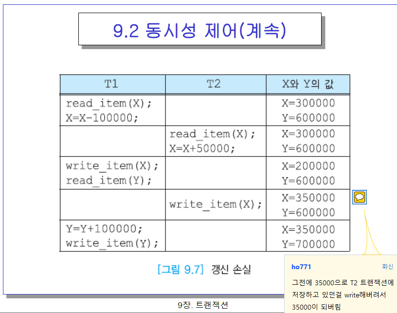

### 로킹 (locking)

- 데이터를 로킹하는 개념은 동시성을 제어하기 위해서 널리 사용되는 기법이다.
- 로크(lock)는 데이터베이스 내의 각 데이터 항목과 연관된 하나의 변수
- 트랜잭션에서 데이터 항목에 접근할 때 로크를 요청하고, 접근을 끝낸 후에 로크를 해제(unlock)함.
    - 갱신 목적 접근: 독점 로크(X-lock, exclusive lock) 요청
    - 읽기 목적 접근: 공유 로크(S-lock, shared lock) 요청

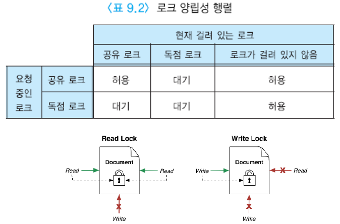

### 2단계 로킹 프로토콜 (2-phase locking protocol)

- 로크를 요청하는 것과 로크를 해제하는 것이 2단계로 이루어짐
- 로크 확장 단계가 지난 후에 로크 수축 단계에 들어감
- 일단 로크를 한 개라도 해제하면 로크 수축 단계에 들어감

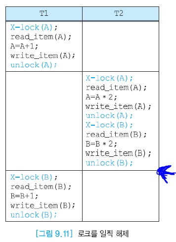
- 위 그림의 화살표에서 철회가 발생하면 오손데이터읽기 발생 → T2는 완료된 상태이므로 A가 (A+1)\*2의 상태, B는 B\*2의 상태가 되어 있어야 되는데 철회되면 원래상태로 돌아가므로 T2기준으로 잘못된 데이터 발생.
- 그래서 트랜잭션 전체가 끝날 때 까지는 로크를 잠그고 있어야 함

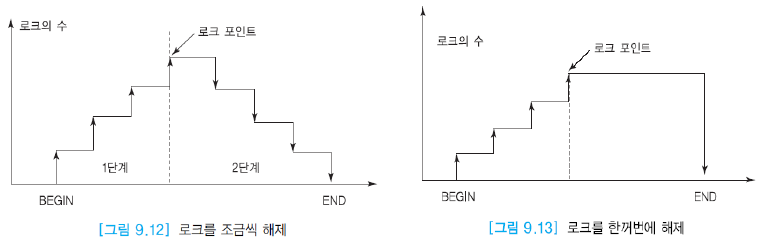
- 로크 확장 단계 (1단계)
    - 트랜잭션이 데이터 항목에 대해 새로운 로크를 요청할 수 있지만 보유하고 있던 로크는 해제할 수 없다.

- 로크 수축 단계 (2단계)
    - 보유하고 있던 로크를 해제할 수 있지만 새로운 로크를 요청할 수 없다.
    - 보유하고 있던 로크를 점차 조금씩 해제할 수도 있고(2PL) 완료 시점에 한꺼번에 모든 로크를 해제할 수도 있다(Strict 2PL).
    - 그러나 일반적으로는 한꺼번에 해제하는 방식을 사용한다. → 이유는 회복(Recoverability)때문이다.

- 로크 포인트(lock point): 한 트랜잭션에서 필요로 하는 모든 로크를 걸어놓은 시점

### 데드록 (deadlock)

- 2단계 로킹 프로토콜에서는 데드록이 발생할 수 있다.
- 데드록은 두 개 이상의 트랜잭션들이 서로 상대방이 보유하고 있는 로크를 요청하면서 기다리고 있는 상태를 말한다.

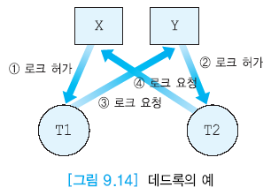

### 다중 로크 단위 (multiple granularity)

- tuple 단위
- block 단위
- file 단위

- 일반적으로 granularity가 적은 것으로 로크를 쓴다.
- 로크 단위가 작을수록 로킹에 따른 오버헤드는 증가하지만 동시성의 정도가 증가한다.

### 팬텀 문제 (phantom problem)

- 팬텀(phantom, ghost)이 발생하는 문제
- 두 개 이상의 트랜잭션이 있을 때 동시에 진행되면서 한 트랜잭션에서 다른 시간에서 SELECT문을 실행시켰을 때 수행결과가 다르게ㅔ 나타나면서 팬텀이 발생

## 9.3 회복

### 회복의 필요성

- 어떤 트랜잭션을 수행하는 도중에 시스템이 다운되었을 때, 해당 트랜잭션의 수행효과가 디스크의 데이터베이스에 일부 반영되었을 경우 그것을 돌려 놓아 원자성을 보장해야 함.
- 트랜잭션이 완료된 직후 시스템이 다운되었을 때, 해당 트랜잭션의 모든 갱신 효과가 메인메모리에서 디스크로 기록되지 않았을 경우 어떻게 그것을 제대로 반영되도록 할 것인가.

### 회복의 개요

- 데이터베이스 시스템은 버퍼를 이용한다는 것을 염두해 두어야 한다.
- 회복 모듈은 재수행(REDO)와 취소(UNDO)를 상황에 따라 잘 수행해야 한다.

### 저장 장치의 유형

- 메인메모리는 휘발성이라서 시스템이 다운되거나 종료되면 그 속의 데이터는 모두 사라진다.
- 디스크는 비휘발성이라서 데이터가 유지된다.
- 두 개 이상의 비휘발성 저장 장치가 동시에 고장날 가능성이 낮으므로 두 개 이상의 사본을 중복해서 저장함으로써 안전 저장 장치를 구현한다.

### 재해적 고장과 비재해적 고장

- 재해적 고장
    - 디스크 손상으로 데이터베이스를 읽을 수 없음
    - 백업 디스크를 기반으로 회복함

- 비재해적 고장
    - 그 이외의 고장
    - 로그를 기반으로 한 즉시 갱신을 주로 이용한다.

### 로그를 사용한 즉시 갱신

- 로그(log)라고 부르는 특별한 파일을 유지한다.
- 데이터베이스의 항목에 영향을 미치는 모든 트랜잭션의 연산들에 대해서 로그 레코드를 기록한다.
- 로그는 undo를 하기 위한 데이터와 redo를 할 수 있는 충분한 정보를 가지고 있다.
- 각 로그 레코드는 로그 순서 번호(LSN: Log Sequence Number)로 식별된다.

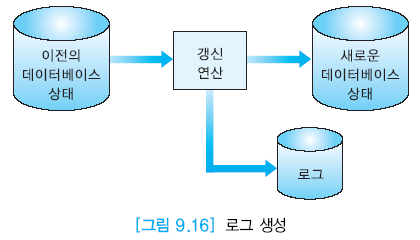

- 로트 파일은 append모드로 돌아감. 순서대로 계속 저장된다는 것.
- 로그 레코드들은 연결 리스트로 유지된다.

### 트랜잭션의 완료점 (commit point)

- 디스크 로그에 \[..., commit\]이 기록되었을 때 commit된 것이라 할 수 있다.
- DBMS의 회복 모듈은 start, commmit로그가 모두 존재하는 트랜잭션들을 재수행하고, start만 있는 트랜잭션들은 재수행하지 않고 취소를 한다.

### 로그 먼저 쓰기 (WAL: Write-Ahead Logging)

- 로그와 데이터베이스 중에 로그를 먼저 저장하는 것
- 트랜잭션 수행 중에 시스템이 crash가 나거나 다운되면 로그가 없으면 데이터베이스 상태가 비정상적이 될 수 있다.
- 그리고 로그로 redo와 undo를 하기 때문에 WAL을 해야한다.
- 블록헤더에서 페이지별로 page-LSN을 가지고 관리함. → 언제부터 redo, undo를 할지

### 체크포인트(checkpoint) 필요성

- 빠르게 재부팅되는 것도 중요하므로 체크포인트 사용.
- 오래된 로그는 이미 갱신된 사항일 가능성이 크므로 체크포인트 사용으로 그 전의 사항은 이용하지 않음.
- 원래는 체크포인트를 저장할 때 수행중인 트랜잭션을 일시중지 시키고 저장한다.
- 요즘에는 중지시키지 않고 체크포인트를 기록한다.

## 9.4 PL/SQL의 트랜잭션

### 트랜잭션의 시작과 끝

- 오라클에서 한 트랜잭션은 암시적으로 끝나거나 명시적으로 끝날 수 있다.
- 오라클을 정상적으로 종료했을 때는 수행중이던 트랜잭셩니 암시적으로 완료(commit)된다.
- COMMIT, ROLLBACK, SAVEPOINT를 이용하여 트랜잭션의 논리를 명시적으로 제어할 수 있다.

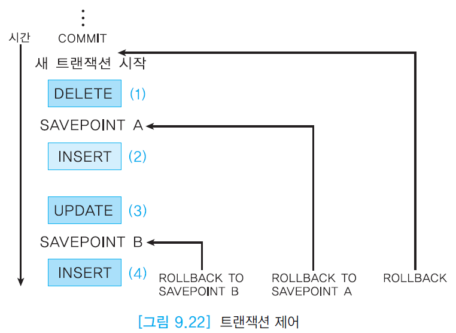
